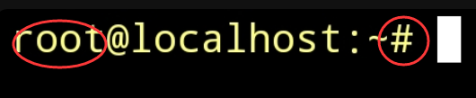
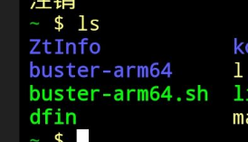
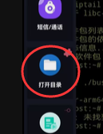
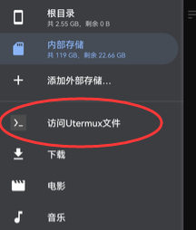

ZeroTermux 是基于 termux 二次开发的，Android终端应用程序和Linux环境。
相较于Termux, ZeroTermux 集成了很多实用的功能如备份恢复，容器切换，文件管理器等实用的功能，对新手非常友好

下文中的 Termux 均指代 ZeroTermux


由于 Termux 与 Linux，有许多[不同之处](https://wiki.termux.com/wiki/Differences_from_Linux), 
存在许多限制，因此我们在在使用Termux 时一般通过使用 PRoot 设置 Linux 发行版 rootfs 来绕过这些限制。


# 准备工作
更换镜像源，点击音量上键，点击`切换源`，切换为`清华源`或者`北京源`

遇到yes/no全选y

注意，该方法只适用于 termux 会话中， 若你的会话处于proot容器内，请先停止当前任务，输入`exit`退出proot容器


# 如何区分会话是否处于proot容器内？


- 方法1
查看终端的提示符

当终端的提示符为“#”时，您的会话正处于proot容器



如果提示符是“$”，您的会话不在proot容器


- 方法2
查看用户

如果用户显示的是root，您的会话正处于proot容器

如果没有显示用户，您的会话不在proot容器


# 如何进入proot 容器？

- 1. 如果你是用tmoe安装的proot 容器，那么你应该用tmoe来进入proot容器，输入命令 tmoe，打开tmoe 菜单，根据提示启动

- 2. 如果你是使用左侧`发行版本`选项安装的 proot 容器，那么在初始的目录下会生产一个启动脚本， 脚本通常以 arm64.sh结尾
    
    可以输入`ls`命令查看
    

    启动示例 ```bash buster-arm64.sh``` 或者 ```./buster-arm64.sh```


# 如何备份容器？

注意，该方法只适用于 termux 会话中， 若你的会话处于proot容器内，请先停止当前任务，输入`exit`退出proot容器

音量上键 选择 `备份/恢复`，在弹出的对话框中选择`tar.gz`

等待备份完成后，你将在你的手机的 `/sdcard/xinhao/data` 目录看到生成的恢复包，

你可以将此恢复包发送给你的朋友们

# 如何恢复容器？
 
注意，该方法只适用于 termux 会话中， 若你的会话处于proot容器内，请先停止当前任务，输入`exit`退出proot容器

恢复前请先确保 你的恢复包处于  `/sdcard/xinhao/data` 目录

和备份操作一样，进入对话框，点击恢复项，选择一个恢复包，输入新的容器名称即可开始恢复

建议容器起名清晰明了，，否则容器多了你会分不清的；
不用的容器即使删除，释放手机存储空间

# 如何使用文件管理器修改容器文件？

ZeroTermux 集成了强大的文件管理器，你可以通过该插件来修改容器内的文件

音量上键呼出菜单栏，拉到下面，找到打开目录，你会安装一个插件


打开该插件，右侧菜单， 访问Utermux文件


# [如何安装 proot 容器](./install_debian.md)