上文提到，Termux 存在许多限制，如无法安装某些软件包，
proot容器可以帮助我们绕过这些限制

目前有两种方法安装proot 容器

# 1 使用自带的安装工具（推荐）
    - 1.2 打开工具
    音量上键->左侧菜单栏（第五个）->发行版本->最新版本

    - 1.2 选择版本
    proot容器(running linux in termux)

    安装arm64 Linux系统(proot容器)

    debian

    debian 10 (buster)
    - 1.3 开始安装

    - 1.4 安装完成
    打开yti tools -> 不用

    - 1.5 启动
    ```shell
    bash ~/buster-arm64.sh
    ```


# 2 使用tmoe安装

### 2.1 运行脚本
在termux 终端输入

```
bash -c "$(curl -L https://gitee.com/mo2/linux/raw/2/2)"
```

### 2.2 更改镜像源


切换镜像源输入y，回车


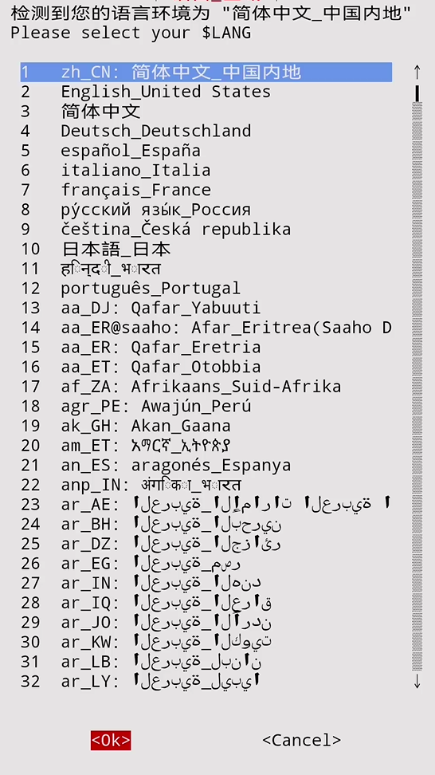

选择语言


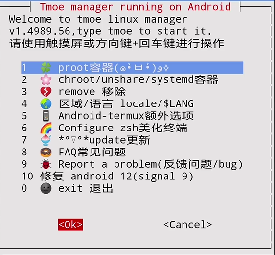

选择proot容器


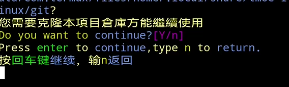

回车


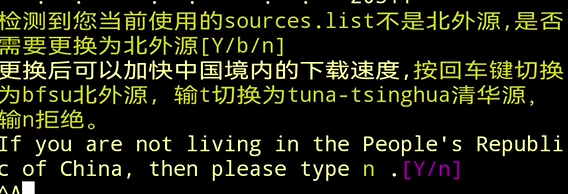

输入y，回车


回车


选择proot容器

### 2.4 设置主题


选中一个配色后选择ok，也可以选择跳过


选中一个字体加粗后选择ok，也可以选择跳过


修改虚拟键盘的布局，不建议修改

### 2.5 设置DNS及时区
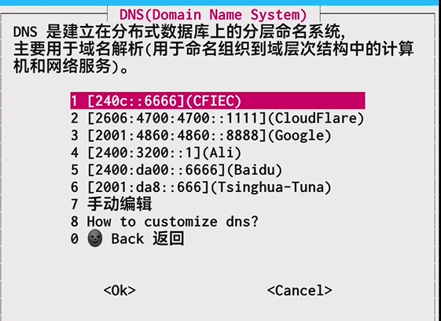

设置DNS，随便选


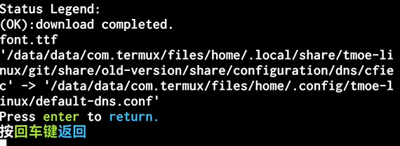

回车返回


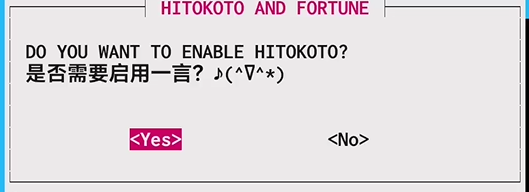

启用一言


设置时区为上海，选择yes

### 2.6 挂载目录

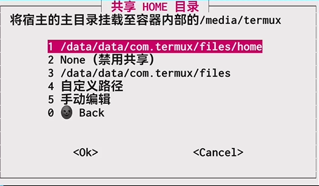

挂载目录，以后下载文件什么的都很方便


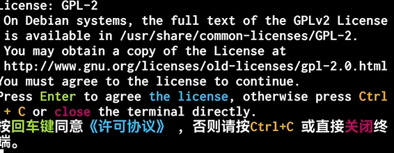

同意协议

### 2.7 选择发行版本


选择 arm64 容器发行版本列表


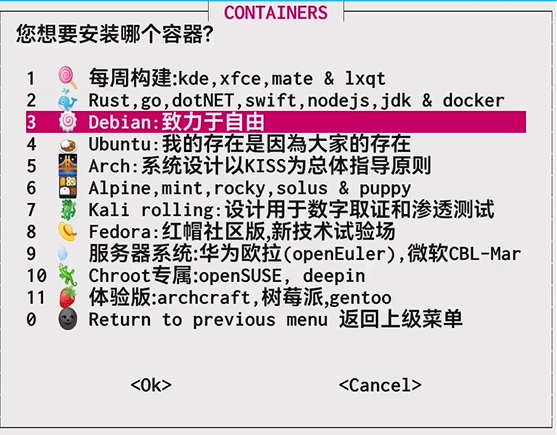

选择 Debian: 致力于自由


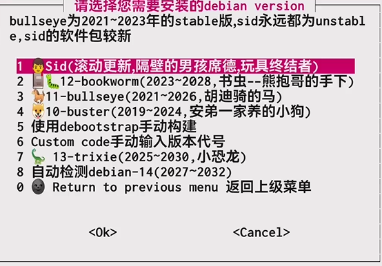

建议选择stable 10-buster


选择启动proot,回车

### 2.7 开始安装 proot 容器


回车


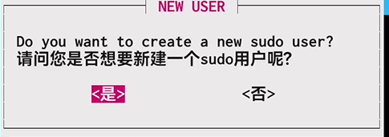

sudo用户基本用不到，可选


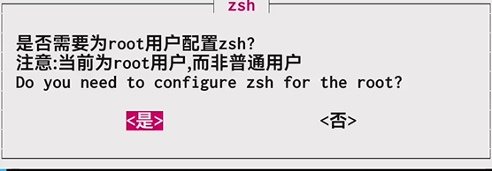

可选


退出

### 2.8 退出及启动proot容器
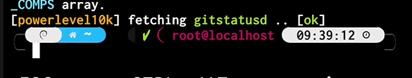

你已成功安装了debian-10-arm64，输入exit 即可退出proot容器
下次启动只需要输入 debian


