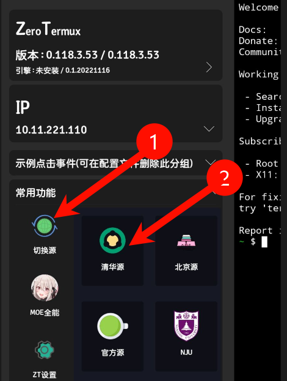
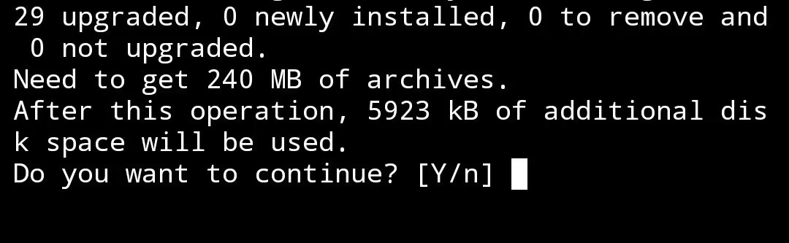
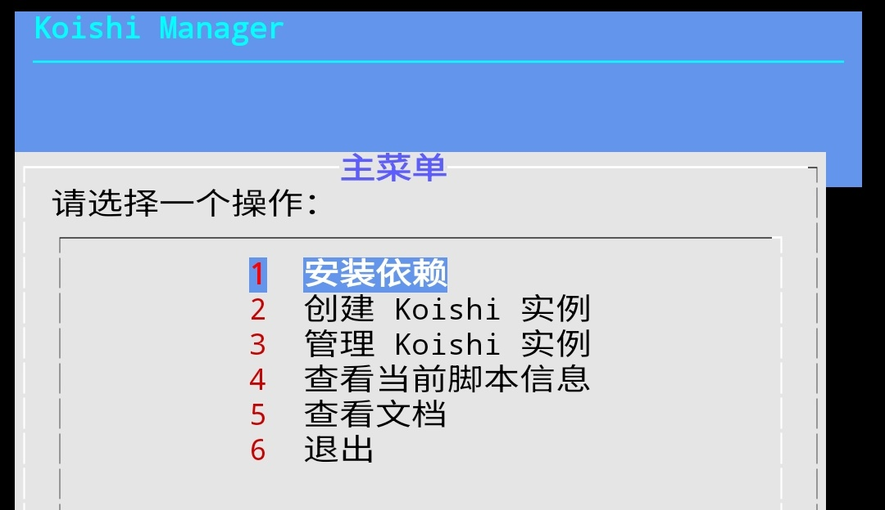
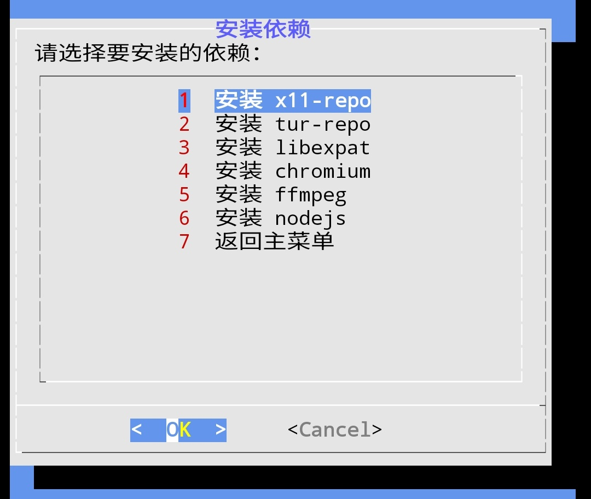
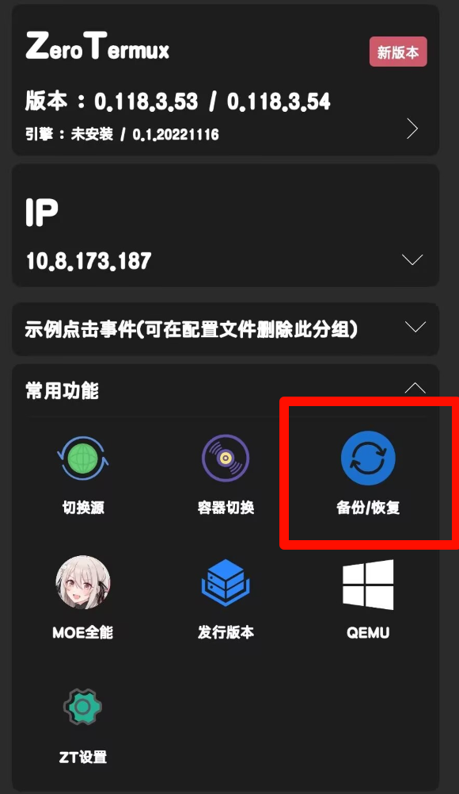

# Koishi Manager for Termux

这是一个用于在 Termux 上管理 Koishi 实例的脚本工具。

通过这个工具，你可以轻松安装依赖、创建和管理 Koishi 实例。

## 推荐环境

建议使用 **Zero Termux**，它提供了更好的 Termux 体验和快捷功能。

- [Zero Termux - 镜像下载](https://od.ixcmstudio.cn/repository/main/ZeroTermux/)
- [Zero Termux - GitHub 发布页](https://github.com/hanxinhao000/ZeroTermux/releases)

:::info
如果你执意使用 **原版termux**，那以下很多快捷键你将无法使用。

推荐使用与教程一致的 **Zero Termux**
:::

## 初始设置

### 1. 切换源

- 打开 Zero Termux
- 按【音量上键】，进入 Zero Termux 快捷交互菜单
- 依次点击【常用功能】→【切换源】→【清华源】



:::tip
如果遇到确认步骤，例如

```log
Do you want to continue? [Y/n]
```

请输入 `Y` ，并回车确认
:::



### 2. 更新包管理器

切换完清华源后，

在 Termux 中运行以下命令以更新**包管理器**：

```bash
pkg update -y

```

> 如果也遇到了类似的确认步骤，操作方法同上。

---

### 3. 安装 Koishi Manager

运行以下命令 下载并运行脚本：

```bash
bash -c "$(curl -L https://gitee.com/initencunter/koimux_bot/raw/master/script/koimuxTUI.sh)"
```

:::info
以上为 **gitee源（国内直接访问）**，你也可以使用 github源，效果一致：

```bash
bash -c "$(curl -L https://raw.githubusercontent.com/initialencounter/koimux_bot/refs/heads/master/script/koimuxTUI.sh)"
```

:::

---

运行后会提示

```log
==========================================
快捷指令 'koimux' 已注册并生效！
脚本源: https://.../.../koimuxTUI.sh
==========================================
按任意键继续...
```

为**正常现象**，下次启动直接输入 `koimux` 即可启动啦~

在此处按下任意键以继续。

### 4. 架构不支持

如果你看见类似 `不支持 x86/x86_64 架构` 的文字，请查看详情

否则请略过此步

<details>
<summary><strong>不支持 x86/x86_64 架构</strong></summary>

经过上述第三步的确认，部分机型可能会遇到此类输出：

```log
==========================================
错误：不支持 x86/x86_64 架构
==========================================

检测到您正在使用 x86/x86_64 架构的设备或模拟器。
此脚本不支持在该架构上运行。

原因：
  x86 架构的 Termux 在运行 Node.js 时
  存在已知的兼容性问题。

建议：使用 ARM64 (aarch64) 架构的真机设备

检测到的架构信息：
  真实架构: x86_64
  系统报告: armv8
==========================================

按任意键退出...
```

这说明你正在使用 x86/x86_64 架构的设备或模拟器，需要使用 ARM64 (aarch64) 架构的真机设备以继续。

</details>

## 使用步骤

### 1. 安装依赖

- 在脚本的主菜单中，选择【1 安装依赖】



- 依次安装所有依赖项（x11-repo、tur-repo、libexpat、chromium、ffmpeg、nodejs 等）

:::danger
注意

此步骤需要**科学上网**！（可以仅在此步使用VPN工具）

建议使用 -> <https://github.com/MetaCubeX/ClashMetaForAndroid/releases>
:::

- 安装完依赖后，选择【7 返回主菜单】



### 2. 创建 Koishi 实例

:::danger
请务必看完整个步骤教程 再跟进实操

以避免误操作、频繁切换窗口... ...
:::

1. 在主菜单中，选择【2 创建 Koishi 实例】
2. 继续确认选择【Yes】
3. 接下来以 **回车键** 为确认键，建议使用默认选项
4. 经过多步确认、完成创建后，Koishi 会自动启动，并在浏览器中打开 WebUI

:::tip
**提示**

除非你需要创建多个koishi实例，否则不建议修改默认选项。

如果希望多开实例，**请确保实例目录名称唯一！** 这很重要！

例如，如果已经创建了`koishi-app`，再次创建koishi实例时，请务必使用其他项目名称，例如 `koishi-app2`，否则会导致数据被覆盖而丢失！
:::

### 3. 实例目录

- 本脚本创建的 Koishi 实例默认存储在 `~/koishi/*/` 目录下
- 默认实例目录为 `~/koishi/koishi-app/`

## 备份与恢复

### 首次创建后务必备份

#### 1. 结束所有进程

多次按下 `Ctrl + C`，确保所有 Koishi 进程已结束。

:::tip
如何按下 Ctrl + C？

点击 ZeroTermux 底部的 `Ctrl` 按钮为高亮状态，然后键盘键入 `C`，即可。
:::

#### 2. 备份实例

- 按音量上键，进入 Zero Termux 快捷交互菜单
- 依次选择【常用功能】→【备份/恢复】→【tar.gz】→【确定】



## 再次启动 Koishi

### 1. 运行脚本

运行以下命令：

```bash
koimux
```

> 以后也都用这个指令 来重新运行脚本哦~

### 2. 管理实例

- 在主菜单中，选择【3 管理 Koishi 实例】
- 选择对应的实例名称
- 选择【1 启动 Koishi (yarn start)】

## 注意事项

- **确保网络畅通**：安装依赖和创建实例时需要联网
- **备份数据**：定期备份 Koishi 实例，防止数据丢失
- **多开实例**：如果需要多开实例，请确保实例目录名称唯一

## 反馈与支持

如果遇到问题，请截图完整日志并反馈至项目仓库：

- [GitHub Issues](https://github.com/initialencounter/koimux_bot/issues)
