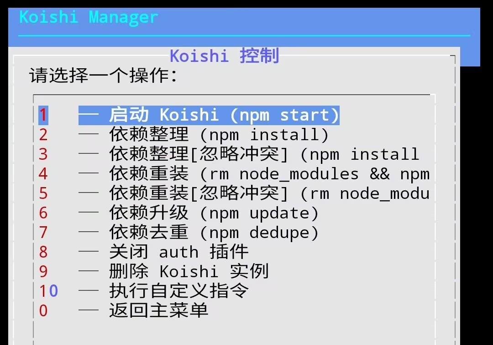

# Koishi 控制菜单

进入主菜单【3 管理 Koishi 实例】后，选择实例，即可看到 Koishi 控制菜单。

本页面介绍控制菜单中每个选项的用途和使用场景。



## 菜单总览

| 编号 | 选项               | 执行的命令                                              |
| ---- | ------------------ | ------------------------------------------------------- |
| 1    | 启动 Koishi        | `npm start`                                             |
| 2    | 依赖整理           | `npm install`                                           |
| 3    | 依赖整理[忽略冲突] | `npm install --legacy-peer-deps`                        |
| 4    | 依赖重装           | `rm -rf node_modules && npm install`                    |
| 5    | 依赖重装[忽略冲突] | `rm -rf node_modules && npm install --legacy-peer-deps` |
| 6    | 依赖升级           | `npm update`                                            |
| 7    | 依赖去重           | `npm dedupe`                                            |
| 8    | 关闭 auth 插件     | 修改 `koishi.yml`                                       |
| 9    | 删除 Koishi 实例   | `rm -rf <实例目录>`                                     |
| 10   | 执行自定义指令     | 用户手动输入                                            |
| 0    | 返回主菜单         | —                                                       |

---

## 选项详解

### 1 ── 启动 Koishi

```bash
npm start
```

启动选定的 Koishi 实例。

- 执行后终端会实时输出 Koishi 的运行日志
- 按 `Ctrl + C` 可停止 Koishi
- 停止后按两次任意键返回控制菜单

:::tip
如何按下 Ctrl + C？

点击 ZeroTermux 底部的 `Ctrl` 按钮为高亮状态，然后键盘键入 `C`，即可。
:::

---

### 2 ── 依赖整理

```bash
npm install
```

安装/整理 `package.json` 中声明的所有依赖。

**适用场景：**

- 首次部署实例后
- 手动修改了 `package.json` 后
- 依赖文件不完整或损坏时

> 不会删除已有的 `node_modules`，只补全缺失的包。

---

### 3 ── 依赖整理[忽略冲突]

```bash
npm install --legacy-peer-deps
```

与选项 2 相同，但会忽略 peer dependency 版本冲突。

**适用场景：**

安装时出现以下错误时使用：

```log
npm error ERESOLVE unable to resolve dependency tree
npm error peer koishi-plugin-word-core@"^1.0.37" from koishi-plugin-word-core-grammar-basic@0.0.78
```

:::tip
什么是 peer dependency 冲突？

当插件 A 要求依赖 X 的版本为 `^1.0.37`，但当前安装的是 `1.0.36` 时，npm 会拒绝安装并报 `ERESOLVE` 错误。

`--legacy-peer-deps` 会跳过此检查，使用 宽松解析策略 完成安装。
:::

---

### 4 ── 依赖重装

```bash
rm -rf node_modules && npm install
```

删除 `node_modules` 目录后重新安装所有依赖。

**适用场景：**

- 依赖出现奇怪的运行时错误
- `node_modules` 目录损坏
- 切换 Node.js 版本后

> 耗时较长，请耐心等待。

---

### 5 ── 依赖重装[忽略冲突]

```bash
rm -rf node_modules && npm install --legacy-peer-deps
```

删除 `node_modules` 后重新安装，同时忽略 peer dependency 冲突。

**适用场景：**

- 选项 3 仍然报 `ERESOLVE` 错误时
- 需要彻底解决依赖冲突问题时

> 这是解决依赖冲突最彻底的方式，优先推荐在遇到冲突时使用此选项。
>
> 耗时较长，请耐心等待。

---

### 6 ── 依赖升级

```bash
npm update
```

将所有依赖升级到 `package.json` 声明的版本范围内的最新版本。

**注意：**

- 只会在 `package.json` 声明的版本范围内升级，不会突破版本锁定
- 如需升级到更高版本（突破版本范围），请使用选项 10【执行自定义指令】手动执行：

  ```bash
  npm install <包名>@latest
  ```

---

### 7 ── 依赖去重

```bash
npm dedupe
```

分析依赖树，合并重复安装的包，减少 `node_modules` 体积。

**适用场景：**

- 安装了大量插件后，`node_modules` 占用空间过大时
- 想优化依赖结构时

> 不会删除任何功能，只是优化目录结构，安全无副作用。

---

### 8 ── 关闭 auth 插件

自动修改 `koishi.yml`，在 `auth` 插件配置前加上 `~` 前缀，使其禁用。

**适用场景：**

- 忘记 auth 登录密码，无法进入 Koishi 控制台时

**使用步骤：**

1. 选择此选项后，会弹出实例选择菜单
2. 选择对应实例，脚本自动修改配置文件
3. 重启 Koishi 实例（选项 1）使修改生效
4. 重新进入控制台后，在插件市场重新启用 auth 并设置新密码

---

### 9 ── 删除 Koishi 实例

```bash
rm -rf <实例目录>
```

永久删除选定的 Koishi 实例目录。

:::danger
**危险操作**

此操作**不可恢复**！

删除前请确保已备份重要数据：

- 数据库文件（`data` 文件夹）

- 配置文件（`koishi.yml`）

- 项目依赖声明（`package.json`）

:::

---

### 10 ── 执行自定义指令

退出 TUI 界面，进入终端输入模式，让用户手动键入任意 Shell 指令并在指定实例目录下执行。

**使用流程：**

1. 选择此选项后，弹出实例选择菜单，选择指令执行的目标目录
2. 选择实例后，终端清屏并显示提示，**Termux 键盘会自动弹出**
3. 输入指令后按回车执行
4. 执行完毕后，按两次任意键返回控制菜单

**常用示例：**

升级指定包到最新版：

```bash
npm install koishi-plugin-word-core@latest
```

升级指定包并忽略冲突：

```bash
npm install koishi-plugin-word-core@latest --legacy-peer-deps
```

查看过时的依赖：

```bash
npm outdated
```

查看已安装的包版本：

```bash
npm list --depth=0
```
