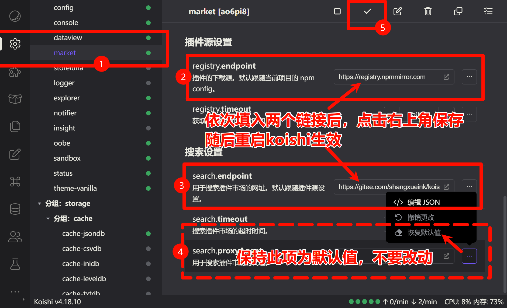

# Termux 环境下 Koishi 使用 market 插件配置指南

## 前置条件

你已经按照 [koimuxTUI.md](./koimuxTUI.md) 文档完成所有依赖安装，并且 Koishi 已经启动成功。

## 配置 插件市场镜像源

**重要提示**：请严格按照图解步骤进行配置，确保配置无误！



相关图例链接：

- 链接1：[https://registry.npmmirror.com](https://registry.npmmirror.com)

```URL
https://registry.npmmirror.com
```

- 链接2：[https://gitee.com/shangxueink/koishi-registry-aggregator/raw/gh-pages/market.json](https://gitee.com/shangxueink/koishi-registry-aggregator/raw/gh-pages/market.json)

```URL
https://gitee.com/shangxueink/koishi-registry-aggregator/raw/gh-pages/market.json
```

配置全部完成后，请重启 Koishi，确保所有配置生效。
