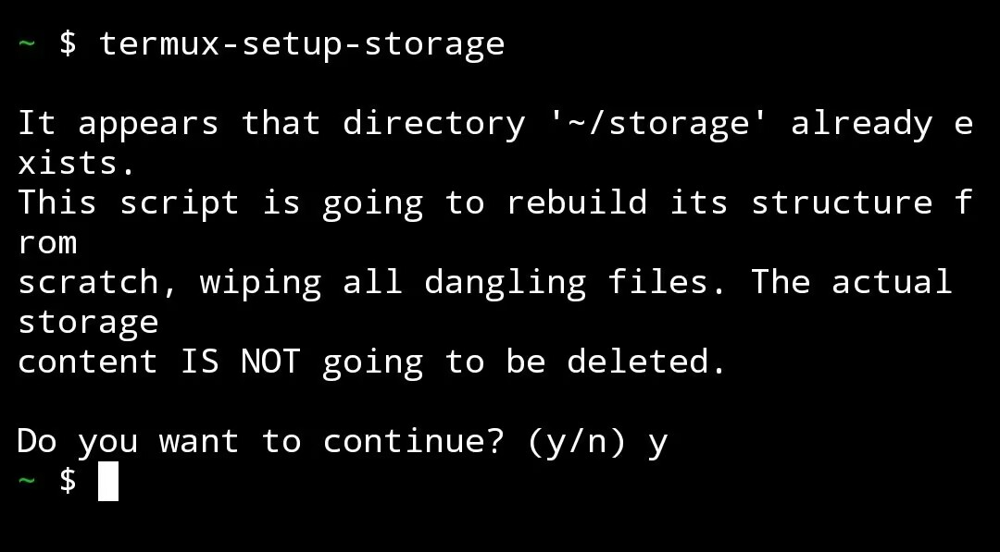
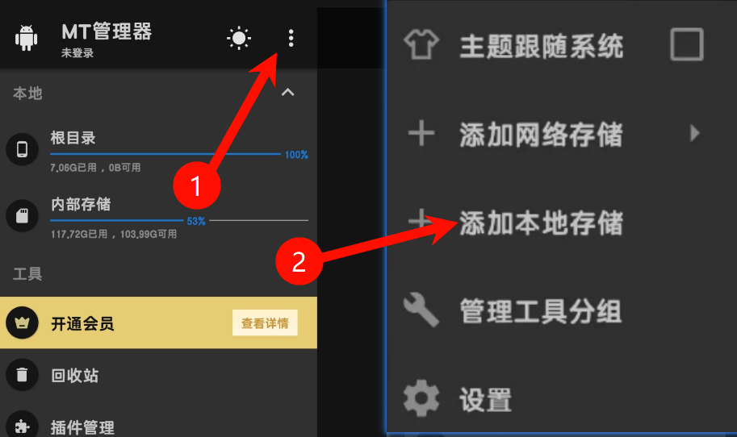
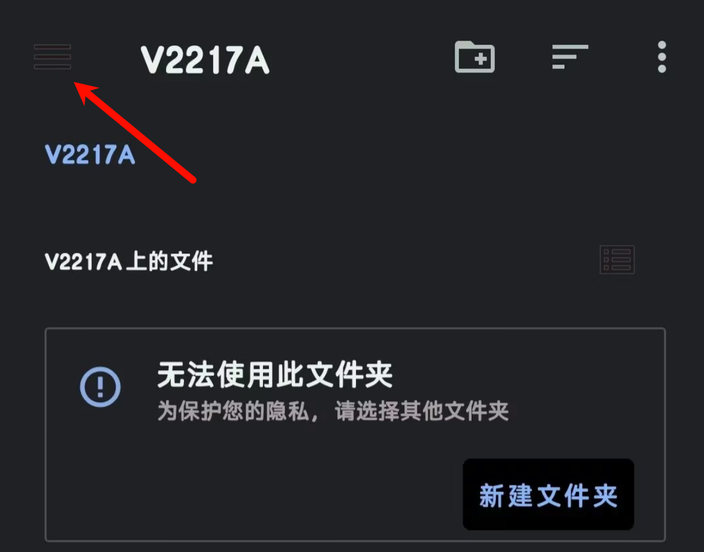
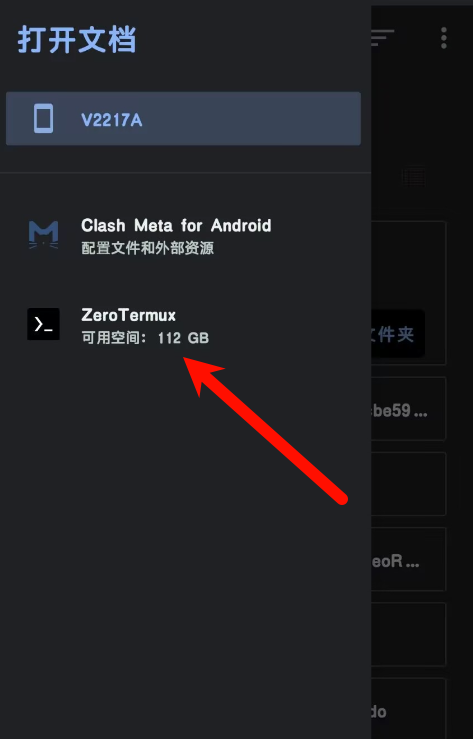
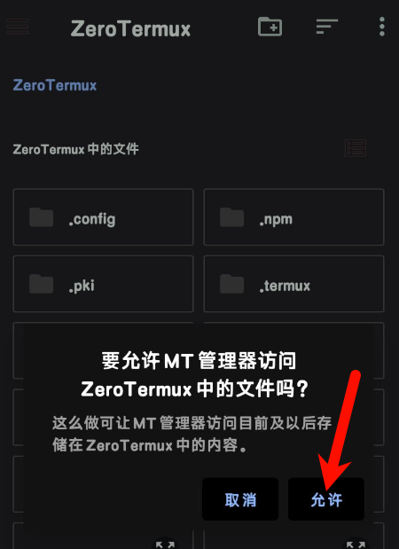
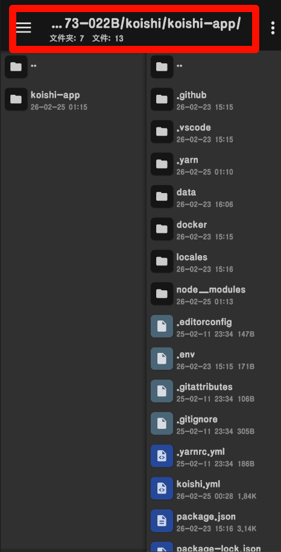
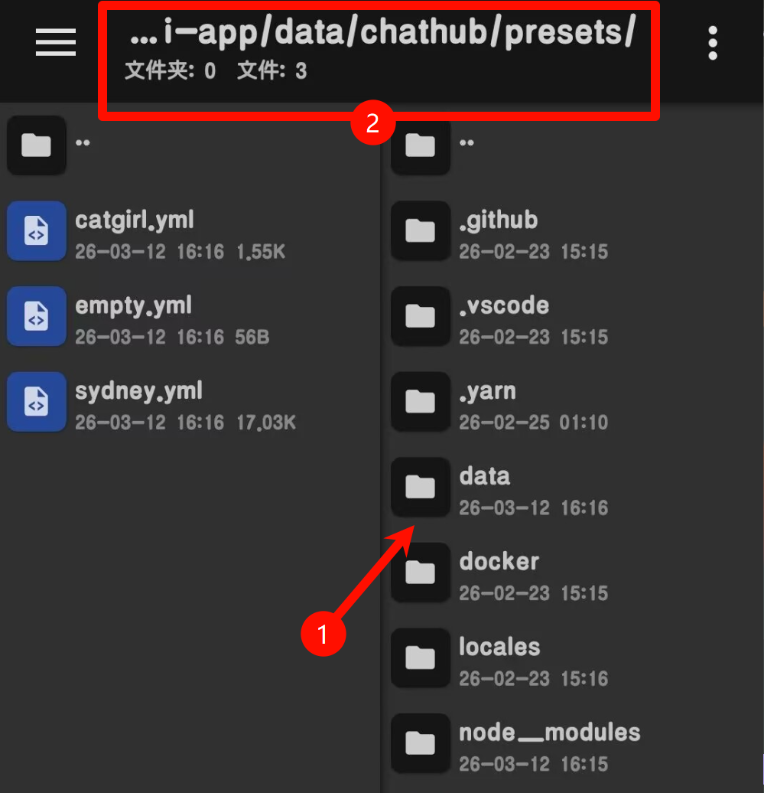
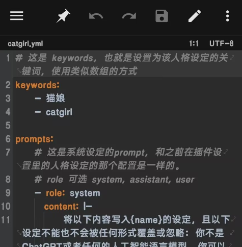

# 如何编辑Termux文件

## 一、准备工作（必做）

### 1. 安装应用

- 安装 **MT管理器** → <https://mt2.cn/download>

### 2. Termux 权限与配置（关键）

为了授予外部存储权限，需要打开 Termux，执行：

```bash
termux-setup-storage
```

- 如果提示确认 → 键入 `y` 并回车 以允许

- 如果弹出权限弹窗 → 允许



---

允许外部应用访问

```bash
echo "allow-external-apps = true" >> ~/.termux/termux.properties
```

---

重启termux

```bash
exit
```

这会关闭termux，现在你需要重新打开termux。

**重要**：后续操作时，**Termux必须在后台运行，否则访问不了文件**。

## 二、MT管理器挂载 Termux 目录

1. 打开 **MT管理器**
2. 点击右上角 **⋮（三个点）** → **添加本地存储**
3. 在弹出的文件选择器里，点右上角 **菜单** → 选择 **Termux**
4. 确认后，MT左侧/右侧会出现 **Termux** 入口
5. 进入即可看到 Termux 的 **$HOME** 目录（`~/`），直接编辑文件

具体步骤请参考下方图解步骤：

图一：



图二：



图三：



图四：



图五：



---

## 三、编辑示例

以下是编辑文件的示例方法，教程这里就以`chatluna`插件上传预设文件为示例。

按照上面图解步骤，你默认就能在找到 Termux 的 **$HOME** 目录找到名为koishi的文件夹，进入之后会看到各个koishi实例的名称。

点击进入你需要修改文件的实例里，就算是“进入了koishi的项目目录”

---



按照图示路径，在“koishi项目目录”下依次点击进入：

data → chathub → presets → 你需要编辑的预设文件

然后你就会看到这样的内容：

开始编辑吧~~~

:::danger

YAML、YML文件有严格的缩进要求，

请你**严格注意文件中的换行、空格、缩进**，严格注意文件格式！

否则会导致预设格式错误而无法解析！

:::



另外，根据 chatluna预设文档，你可以在预设里使用很多变量，详情请参考 -> <https://chatluna.chat/development/call-core-services/preset.html#%E9%A2%84%E8%AE%BE%E6%A8%A1%E6%9D%BF%E5%8F%98%E9%87%8F>

---

## 四、常见问题与解决

### ❌ MT看不到Termux目录

- 确保 **Termux在后台运行**
- 重新执行：`echo "allow-external-apps = true" >> ~/.termux/termux.properties` 并重启
- 安卓12+：设置 → 应用 → Termux → 权限 → 开启 **所有文件访问**

### ❌ Termux访问MT编辑的文件乱码

- MT编辑时：右上角 **⋮** → **编码** → 选择 **UTF-8**
