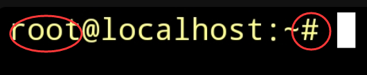
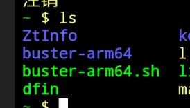
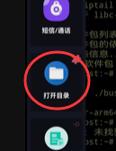
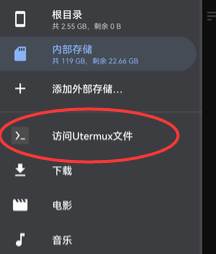

# ZeroTermux 入坑指南

ZeroTermux 是基于 Termux 二次开发的 Android 终端应用程序和 Linux 环境。

相较于原版 Termux，ZeroTermux 集成了备份恢复、容器切换、文件管理器等实用功能，对新手非常友好。

:::tip
说明

下文中的 Termux 均指代 ZeroTermux
:::

## 准备工作

### 更换镜像源

| 步骤 | 操作                                |
| ---- | ----------------------------------- |
| 1    | 按音量上键                          |
| 2    | 在 "常用功能" 下找到并点击 "切换源" |
| 3    | 选择 "清华源" 或 "北京源"           |
| 4    | 遇到 `yes/no` 全选 `y`              |

:::warning
注意

该方法只适用于 Termux 会话中。

若处于 proot 容器内，请先输入 `exit` 退出容器。
:::

## 区分 proot 容器

### 方法一：查看提示符

| 提示符 | 状态   | 说明                |
| ------ | ------ | ------------------- |
| `#`    | 容器内 | 当前处于 proot 容器 |
| `$`    | 容器外 | 当前在 Termux 会话  |




### 方法二：查看用户

显示 `root` 用户表示处于 proot 容器内。

## 进入 proot 容器

### tmoe 安装的容器

```bash
tmoe
```

打开 tmoe 菜单，根据提示启动。

### 发行版本安装的容器

在初始目录下会生成启动脚本，通常以 `arm64.sh` 结尾。

查看启动脚本：

```bash
ls
```



启动容器：

```bash
bash buster-arm64.sh
```

或

```bash
./buster-arm64.sh
```

## 备份容器

:::warning
前提条件

必须在 Termux 会话中操作，若处于 proot 容器内，请先输入 `exit` 退出。
:::

| 步骤 | 操作                        |
| ---- | --------------------------- |
| 1    | 按音量上键                  |
| 2    | 选择"备份/恢复"             |
| 3    | 在弹出对话框中选择 `tar.gz` |
| 4    | 等待备份完成                |

备份文件将保存在 `/sdcard/xinhao/data` 目录，可以分享给其他用户。

## 恢复容器

:::warning
前提条件

- 必须在 Termux 会话中操作
- 恢复包必须位于 `/sdcard/xinhao/data` 目录

:::

| 步骤 | 操作             |
| ---- | ---------------- |
| 1    | 按音量上键       |
| 2    | 选择"备份/恢复"  |
| 3    | 点击恢复项       |
| 4    | 选择恢复包       |
| 5    | 输入新的容器名称 |

:::tip
建议

- 容器命名要清晰明了
- 不用的容器及时删除，释放存储空间

:::

## 文件管理器

ZeroTermux 集成了强大的文件管理器，可以直接修改容器内的文件。

### 安装文件管理器

| 步骤 | 操作                     |
| ---- | ------------------------ |
| 1    | 按音量上键呼出菜单栏     |
| 2    | 拉到下面，找到"打开目录" |
| 3    | 安装插件                 |



### 访问容器文件

打开插件后，在右侧菜单选择"访问 Utermux 文件"。


