# Termux 安装 Debian 容器

Termux 存在许多限制，如无法安装某些软件包。

proot 容器可以帮助我们绕过这些限制。

## 方法一：使用自带工具（推荐）

| 步骤        | 操作                                                          |
| ----------- | ------------------------------------------------------------- |
| 1. 打开工具 | 音量上键 → 左侧菜单栏（第五个）→ 发行版本 → 最新版本          |
| 2. 选择版本 | proot容器 → 安装arm64 Linux系统 → debian → debian 10 (buster) |
| 3. 开始安装 | 等待安装完成                                                  |
| 4. 安装完成 | 打开 yti tools → 选择"不用"                                   |

### 启动容器

```bash
bash ~/buster-arm64.sh
```

## 方法二：使用 tmoe 安装

### 1. 运行安装脚本

```bash
bash -c "$(curl -L https://gitee.com/mo2/linux/raw/2/2)"
```

### 2. 配置镜像源

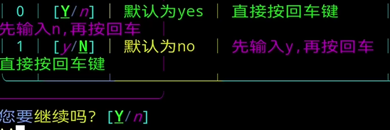

---

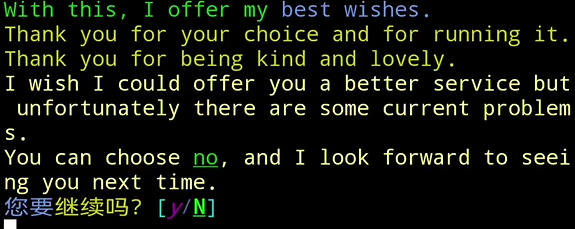

---

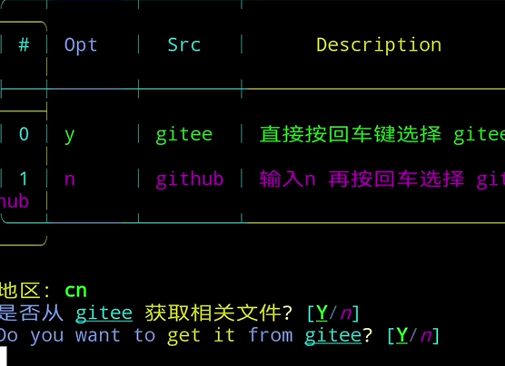

---

切换镜像源时输入 `y`，然后回车。

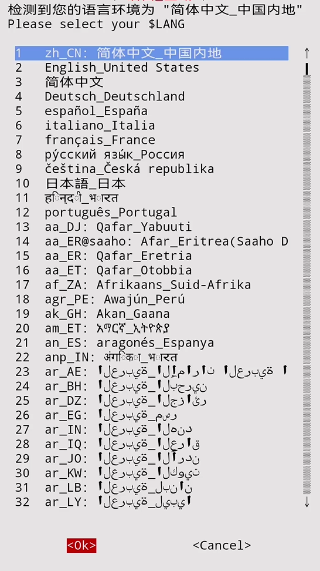

---

### 3. 选择语言

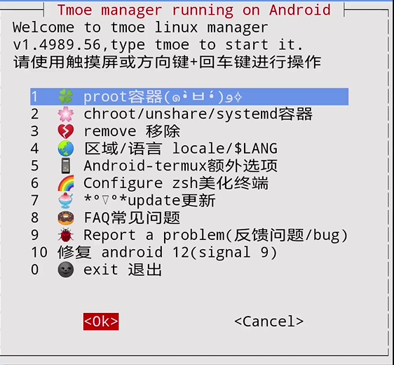

---

选择 proot 容器。

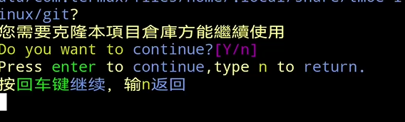

---

回车继续。

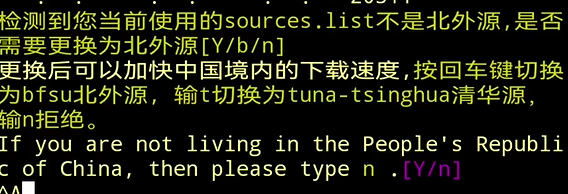

---

输入 `y`，回车。

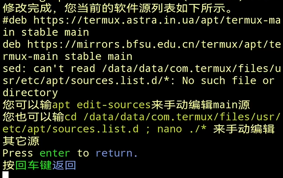

---

### 4. 主题设置

| 设置项   | 说明                       |
| -------- | -------------------------- |
| 终端配色 | 选择喜欢的配色方案，可跳过 |
| 字体加粗 | 选择字体样式，可跳过       |
| 虚拟键盘 | 不建议修改默认布局         |

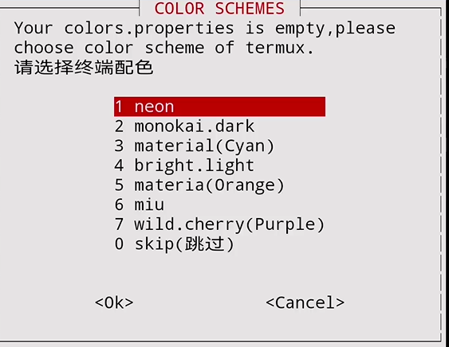

---

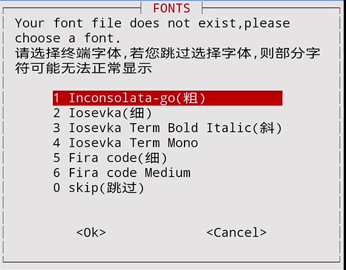

---

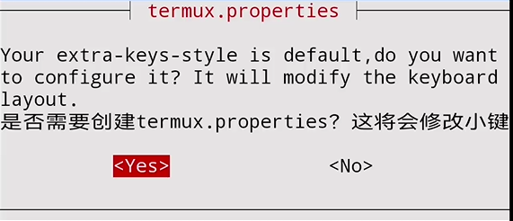

---

### 5. DNS 和时区设置

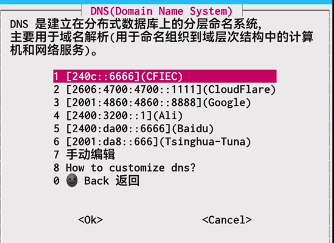

---

设置 DNS，选择任意一个即可。

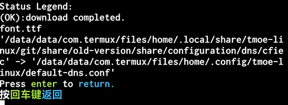

---

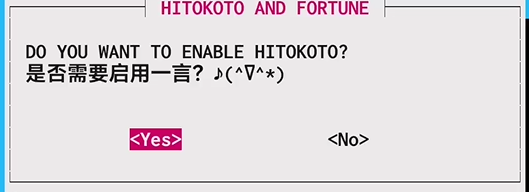

---

启用一言功能（可选）。

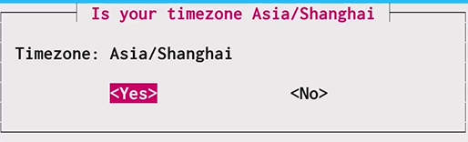

---

设置时区为上海，选择 `yes`。

### 6. 挂载目录

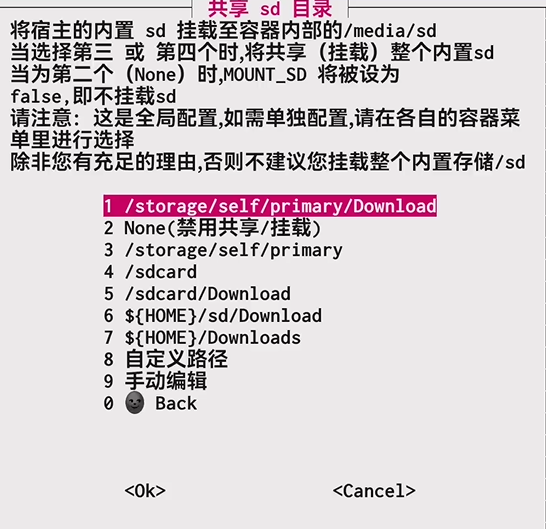

---

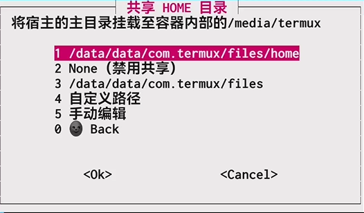

---

挂载目录后，文件操作更加方便。

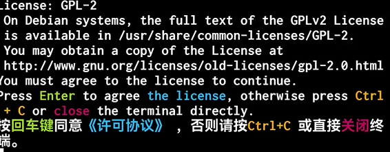

---

同意协议继续。

### 7. 选择发行版

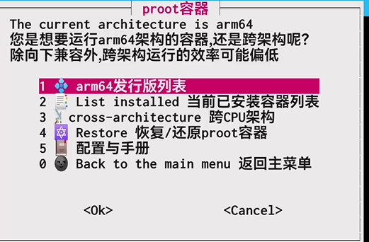

---

选择 arm64 容器发行版本列表。

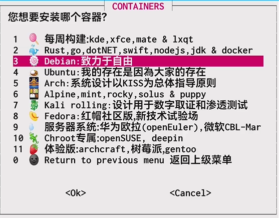

---

选择 Debian。

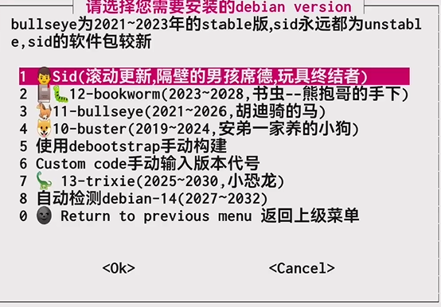

---

建议选择 stable 10-buster。

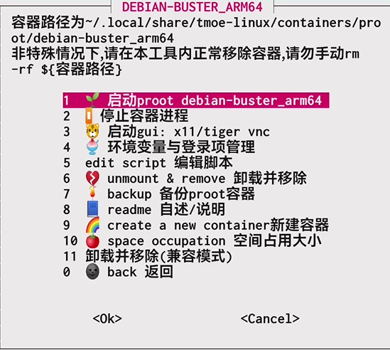

---

选择启动 proot，回车。

### 8. 安装容器

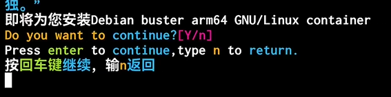

---

回车开始安装。

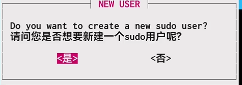

---

sudo 用户基本用不到，可跳过。

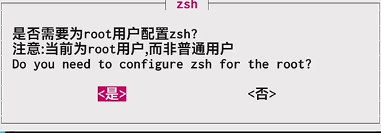

---

可跳过。

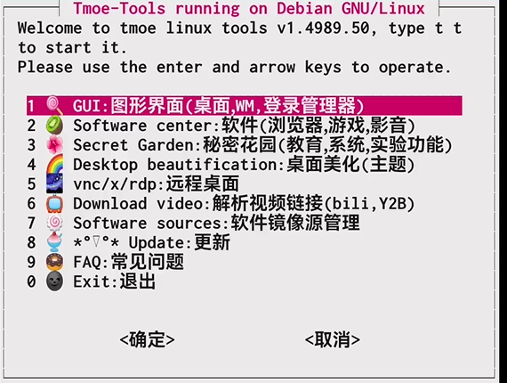

---

### 9. 启动和退出

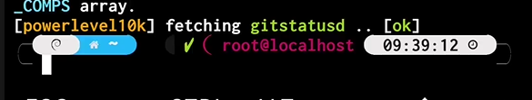

---

安装完成后，输入 `exit` 退出 proot 容器。

下次启动只需输入：

```bash
debian
```

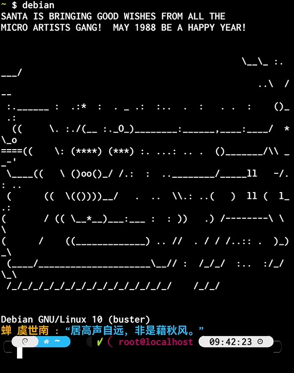

---
