  
<body class="body">
<h1 style="color: #00CED1;">Android——ffmpeg的解决方案</h1>

<blockquote style="color: #FF66DF;font-size: 20px;width:800px">
由于koishi安卓版无法直接安装ffmpeg，用户无法发送语音和视频消息。
为了解决这个问题，我制作了这个termux恢复包，安装了ffmpeg。
这个恢复包提供了一个简单有效的解决方案，让koishi安卓版用户能够享受发送语音和视频消息的功能。
</blockquote>

<h2 style="color: #B18FFF;">准备</h2>

<h3  class="h3" style="text-indent: 2em;">下载 ZeroTermux</h3>

📥 <a href="https://github.com/hanxinhao000/ZeroTermux/releases/download/release/ZeroTermux-0.118.35.3.apk">点击此处下载 ZeroTermux</a>

直接安装即可
 

<h3  class="h3" style="text-indent: 2em;">下载恢复包</h3>

📥 <a href="https://github.com/initialencounter/koimux_bot/releases/download/koimux_bot-v4.5-jellyfish/koimux_bot-4.5-jellyfish.tar.gz">koimux_bot-4.5-jellyfish.tar.gz</a> (大小：743MB)

将其下载到 <code>内部存储/xinhao/data</code> 或 <code>/sdcard/xinhao/data</code> 目录

如果下载速度很慢，可加入QQ群399899914，从群文件中下载恢复包

<h2 style="color: #B18FFF;">恢复</h2>

  

    

      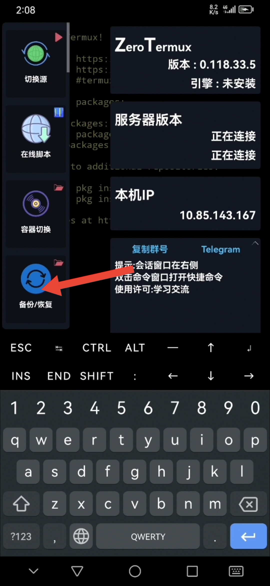
    

    

      <h1 class="p">2.1 打开菜单栏</h1>
      
点击音量上键 或 点击屏幕左侧边缘，打开菜单栏

    

    

      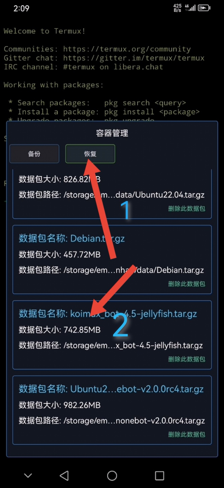
    

    

      <h1 class="p">2.2 恢复</h1>
      
点击恢复 选择刚才下载的恢复包  如未下载请先<a class="button" href='#download' style="color: yellow;">下载</a>

    

  

 

  

    

      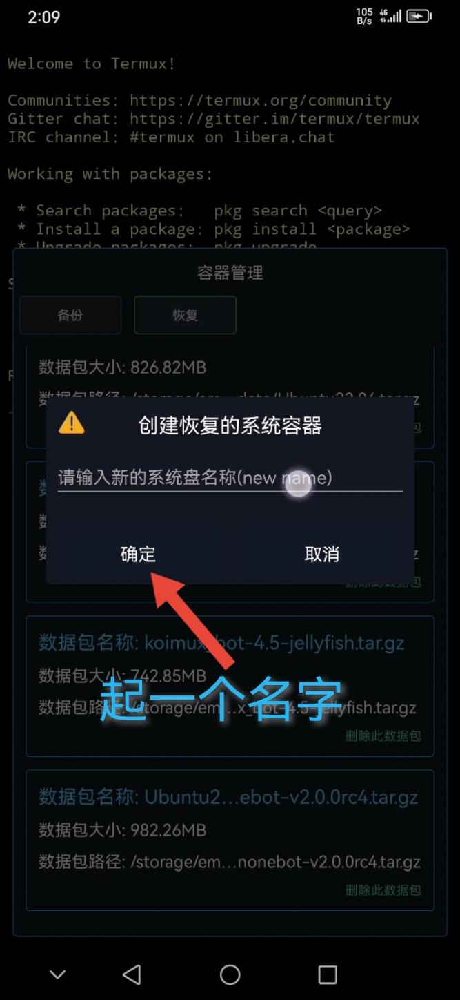
    

    

      <h1 class="p">2.3 恢复</h1>
      
给容器起一个名字，然后点击恢复 

    

    

      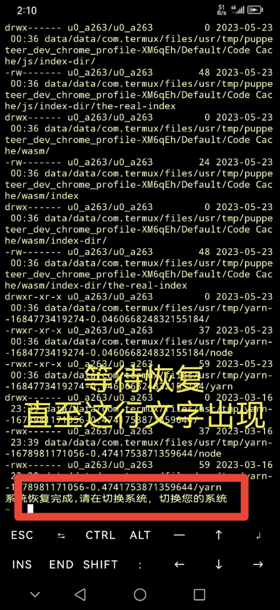
    

    

      <h1 class="p">2.4 等待恢复</h1>
      
等待ZeroTermux恢复容器，该过程大约持续30s, 楼主手机比较旧所以用了1分钟, 

    

  

 

  

    

      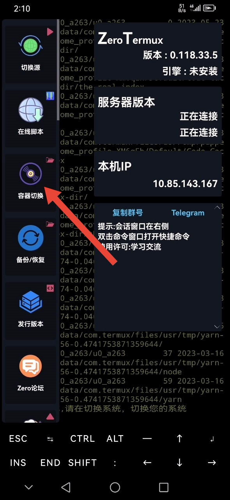
    

    

      <h1 class="p">2.5.1 切换容器</h1>
      
点击音量上键 或 点击屏幕左侧边缘，再次打开菜单栏，点击容器切换

    

     

      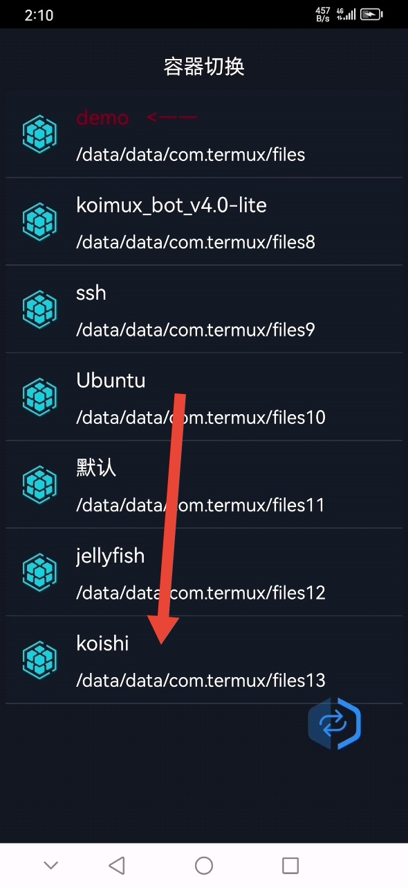
    

    

      <h1 class="p">2.5.2 切换容器</h1>
      
选择刚才命名的容器

    

  

 

  

    

      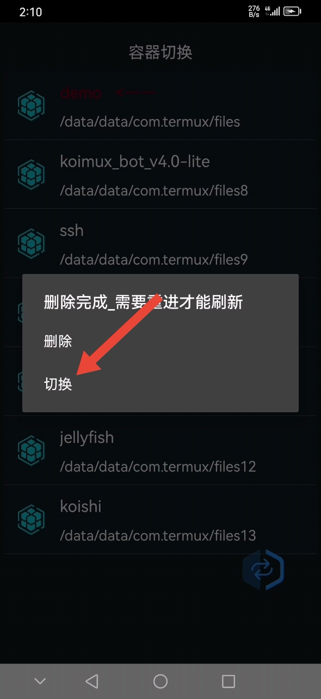
    

    

      <h1 class="p">2.5.3 切换容器</h1>
      
点击切换

    

     

      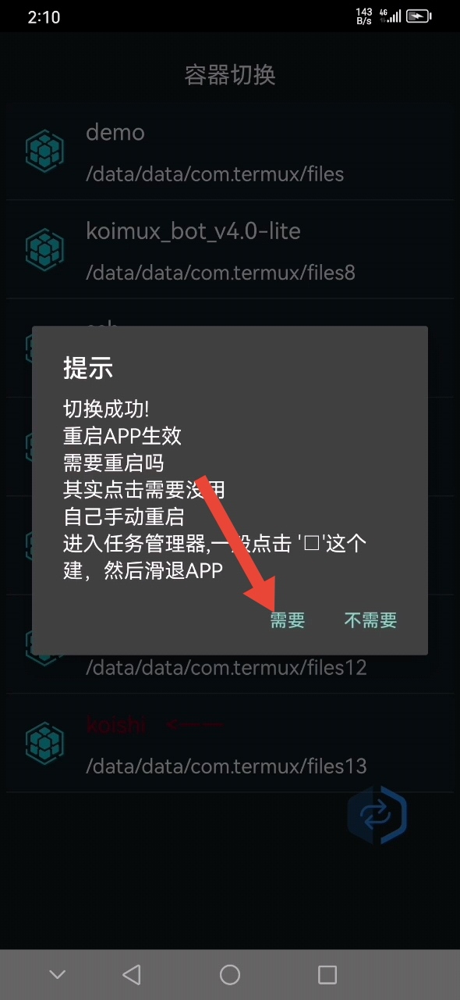
    

    

      <h1 class="p">2.5.4 切换容器 </h1>
      
选择需要重启

    

  

 

  

    

      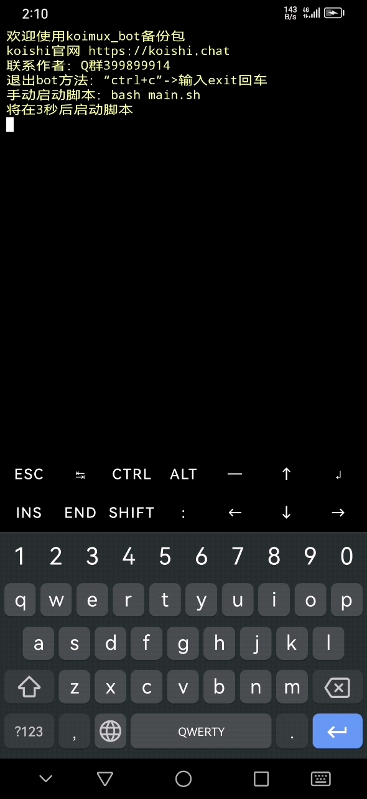
    

    

      <h1 class="p">2.6 启动koishi</h1>
      
在弹出的对话框中选择启动koishi,回车，

    

     

      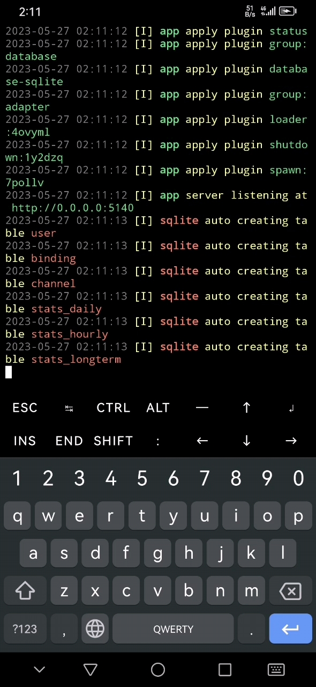
    

    

      <h1 class="p">2.6 启动koishi </h1>
      
等待koishi启动 直至出现app listening at http://127.0.0.1:5140

    

  

 

 

  

    

      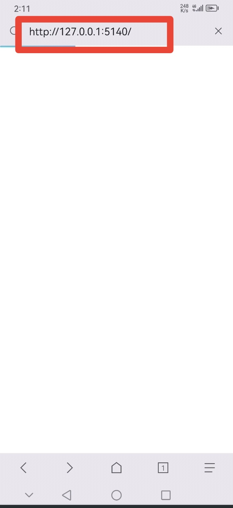
    

    

      <h1 class="p">2.7 打开控制台</h1>
      
在浏览器的地址栏输入 http://127.0.0.1:5140

    

     

      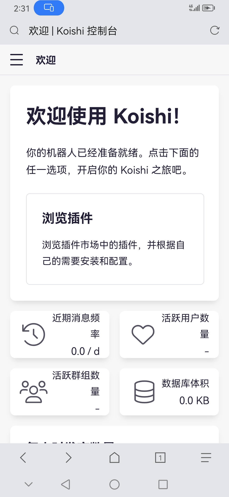
    

    

      <h1 class="p">2.6 部署成功 </h1>
      
恭喜你完成了koishi-termux的部署

    

  

 

<h2 style="color: #B18FFF;">注意事项</h2>

<ul style="color: #333333;">
  <li>下载完成后不要解压恢复包</li>
  <li>不要手动修改/data/data目录</li>
  <li>安装插件或更新插件之前尽可能备份一下</li>
</ul>
</body>